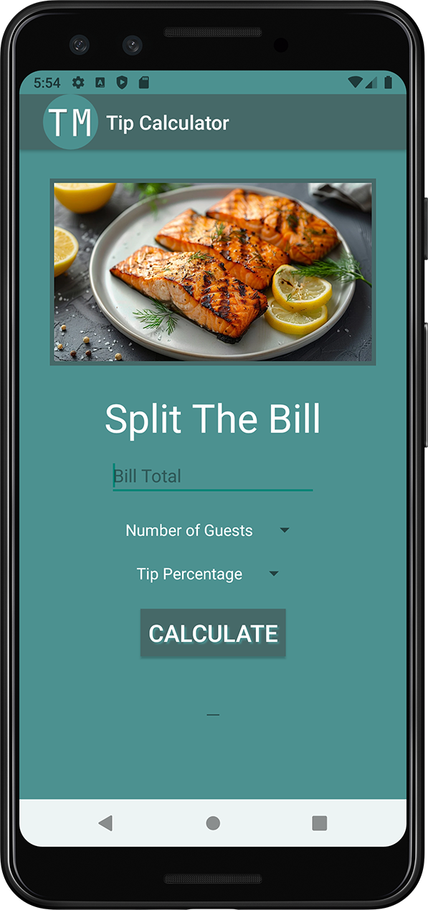
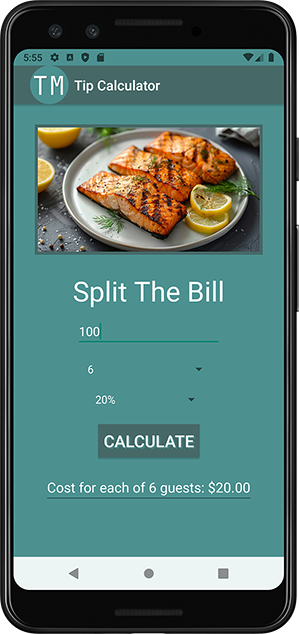
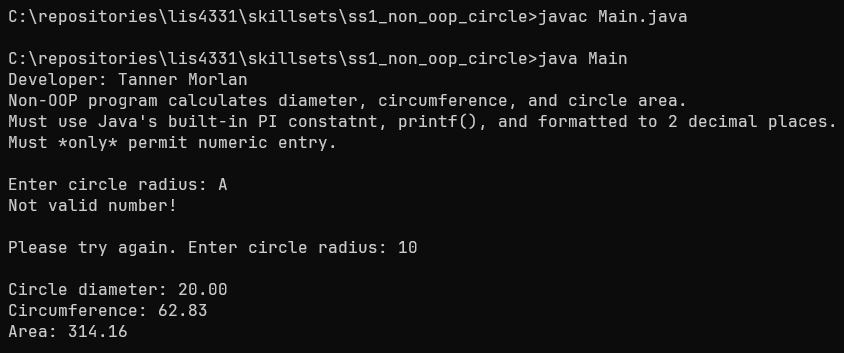
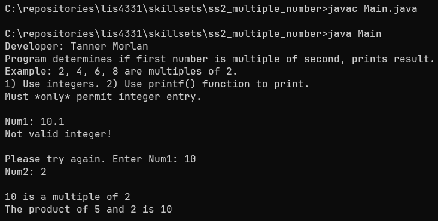
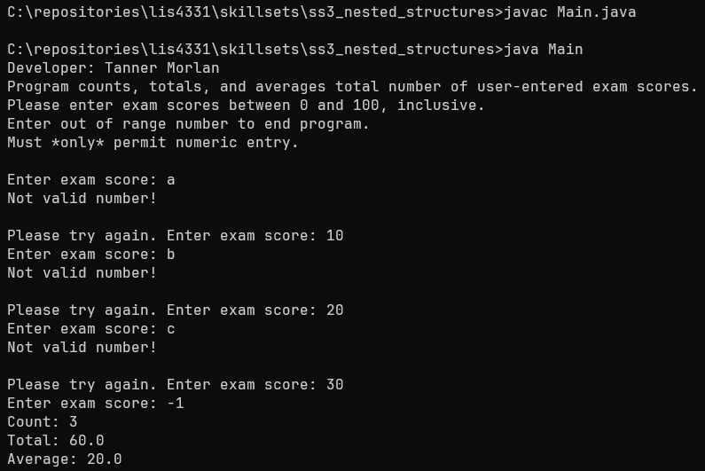

> **NOTE:** This README.md file should be placed at the **root of each of your repos directories.**
>
>Also, this file **must** use Markdown syntax, and provide project documentation as per below--otherwise, points **will** be deducted.
>

# LIS4331 - Advanced Mobile Applications Development

## Tanner Morlan

### **Assignment 2 Requirements:**

*Six Parts*

1. Calculate split bill total
2. Include number of guests and tip percentage functionality
3. Must allow for including decimal point for bill total
4. Drop-down menu for tip percentage (5% increments): 0 - 25
5. Add background color(s)
6. Must create and display launcher icon imag1.

**README.md file should include the following items:**

- Screenshot of running Android Studio - Tip Calculator
- Screenshot of processed input
- GIF of screen rotating
- GIF of horizontal view being scrollable
- Skill set screenshots

> This is a blockquote.
> 
> This is the second paragraph in the blockquote.
>

#### **Assignment Screenshots:**

| *Screenshot of running Android Studio - Tip Calculator* | *Screenshot of processed input* |
| ------------- | ------------- |
|  |  |

| *GIF of screen rotating | *GIF of horizontal view being scrollable* |
| ------------- | ------------- |
|  |  |

#### **Skill Sets:**

| *Code for [Skill Set 1](../skillsets/ss1_non_oop_circle/Methods.java)* | *Code for [Skill Set 2](../skillsets/ss2_multiple_number/Methods.java)* *Code for [Skill Set 3](../skillsets/ss3_nested_structures/Methods.java)*
| ------------- | ------------- | ------------- |
|  |  |  |