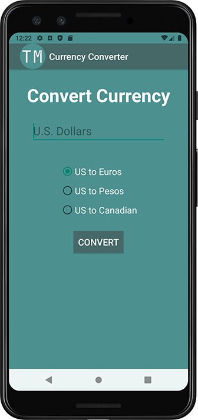
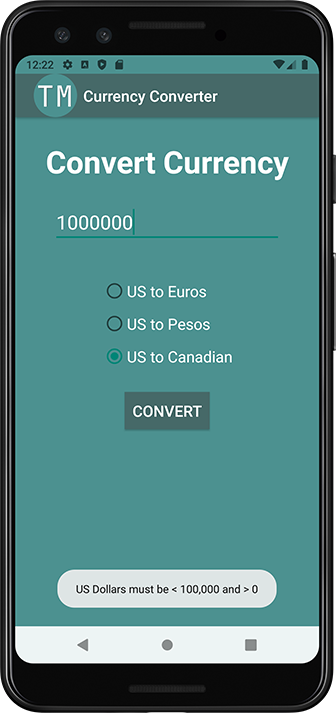
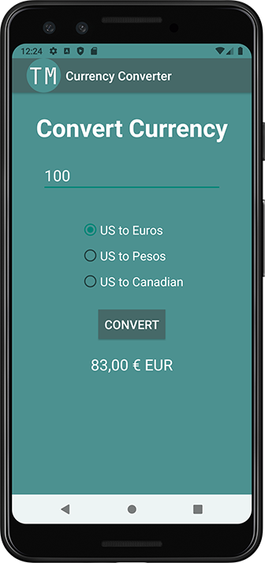
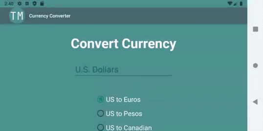

> **NOTE:** This README.md file should be placed at the **root of each of your repos directories.**
>
>Also, this file **must** use Markdown syntax, and provide project documentation as per below--otherwise, points **will** be deducted.
>

# LIS4331 - Advanced Mobile Applications Development

## Tanner Morlan

### **Assignment 3 Requirements:**

*Eight Parts*
1. Field to enter U.S. dollar amount: 1- 100,000
2. Must include toast notification if user enters out-of-range values
3. Radio buttons to convert from U.S. to Euros, Pesos, and Canadian currency (must be vertically and horizontally aligned)
4. Must include correct sign for euros, pesos, and Canadian dollars
5. Must add background color(s) or theme
6. Create and display launcher icon
7. Must be scrollable - *both* horizontally and vertically
8. Create Splash/Loading Screen

**README.md file should include the following items:**

- Screenshot of running application’s splash screen
- Screenshot of running application’s unpopulated user interface
- Screenshot of running application’s toast notification
- Screenshot of running application’s converted currency user interface
- Screenshot of app scrolling
- Screenshot of skill sets

> This is a blockquote.
> 
> This is the second paragraph in the blockquote.
>

#### **Assignment Screenshots:**

| *Screenshot of running application’s splash screen* | *Screenshot of running application’s unpopulated user interface* |
| ------------- | ------------- |
|  |  |

| *Screenshot of running application’s toast notification* | *Screenshot of running application’s converted currency user interface* | *Screenshot of app scrolling* |
| ------------- | ------------- | ------------- |
|  |  |  |

#### **Skill Sets:**

| *Code for [Skill Set 4](../skillsets/ss1_non_oop_circle/Methods.java)* | *Cont.* |
| ------------- | ------------- | ------------- |
|  |  |