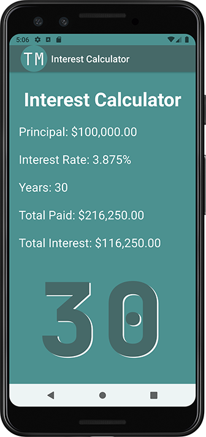

> **NOTE:** This README.md file should be placed at the **root of each of your repos directories.**
>
>Also, this file **must** use Markdown syntax, and provide project documentation as per below--otherwise, points **will** be deducted.
>

# LIS4331 - Advanced Mobile Applications Development

## Tanner Morlan

### **Assignment 4 Requirements:**

*Seven Parts*

1. Include splash screen image (or, create your own), app title, intro text.
2. Include appropriate images.
3. Must use persistent data: SharedPreferences
4. Widgets and images must be vertically and horizontally aligned.
5. Must add background color(s) or theme
6. Create and display launcher icon image
7. App *must* be scrollable—*both* horizontally and vertically

**README.md file should include the following items:**

- Screenshot of splash screen
- Screenshot of main screen
- Gif of app scrolling horizontally
- Screenshot of incorrect years
- Screenshot of valid entry
- Screenshot of calculation
- Screenshots of skill sets

> This is a blockquote.
> 
> This is the second paragraph in the blockquote.
>

#### **Assignment Screenshots:**

| *Screenshot of splash screen* | *Screenshot of main screen* |
| ------------- | ------------- |
|  |  |

| *Gif of app scrolling horizontally* |
| ------------- |
|  |

| *Screenshot of incorrect years* | *Screenshot of valid entry* | *Screenshot of calculation* |
| ------------- | ------------- | ------------- |
|  |  |  |

#### **Skill Sets:**

| *Code for [Skill Set 10](../skillsets/ss10_travel_time/Methods.java)* | *Code for [Skill Set 11-1](../skillsets/ss11_product_class/Product.java) [Skill Set 11-2](../skillsets/ss11_product_class/ProductDemo.java)* | *Code for [Skill Set 12-1](../skillsets/ss12_book_inherits_product_class/Product.java) [Skill Set 12-2](../skillsets/ss12_book_inherits_product_class/Book.java) [Skill Set 12-3](../skillsets/ss12_book_inherits_product_class/BookDemo.java)* |
| ------------- | ------------- | ------------- |
|  |  |  |