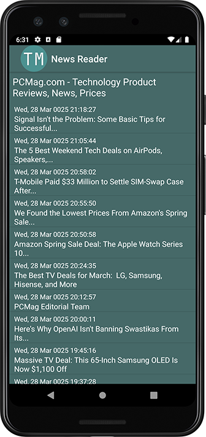
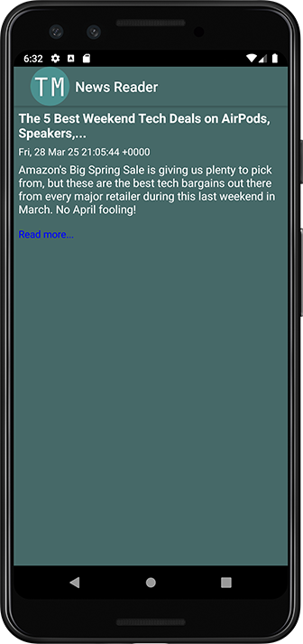
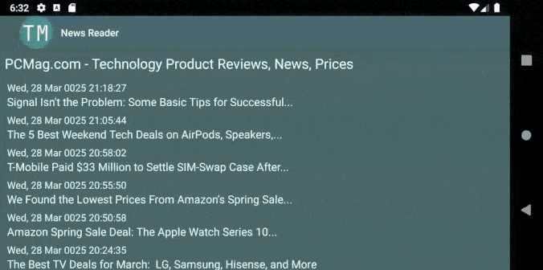

> **NOTE:** This README.md file should be placed at the **root of each of your repos directories.**
>
>Also, this file **must** use Markdown syntax, and provide project documentation as per below--otherwise, points **will** be deducted.
>

# LIS4331 - Advanced Mobile Applications Development

## Tanner Morlan

### **Assignment 5 Requirements:**

*Six Parts*

1. Include splash screen (optional)
2. Main screen with app title and list of articles.
3. Must find and use your own RSS feed.
4. Must add background color(s) or theme
5. Create and display launcher icon image
6. App *must* be scrollable—*both* horizontally and vertically

**README.md file should include the following items:**

- Screenshot of Items Activity
- Screenshot of Item Activity
- Screenshot of Read More...
- Gif of Items Activity Scrolling

> This is a blockquote.
> 
> This is the second paragraph in the blockquote.
>

#### **Assignment Screenshots:**

| *Screenshot of Items Activity* | *Screenshot of Item Activity* |
| ------------- | ------------- |
|  |  |

| *Screenshot of Read More...* | *Gif of Items Activity Scrolling* |
| ------------- | ------------- |
|  |  |
