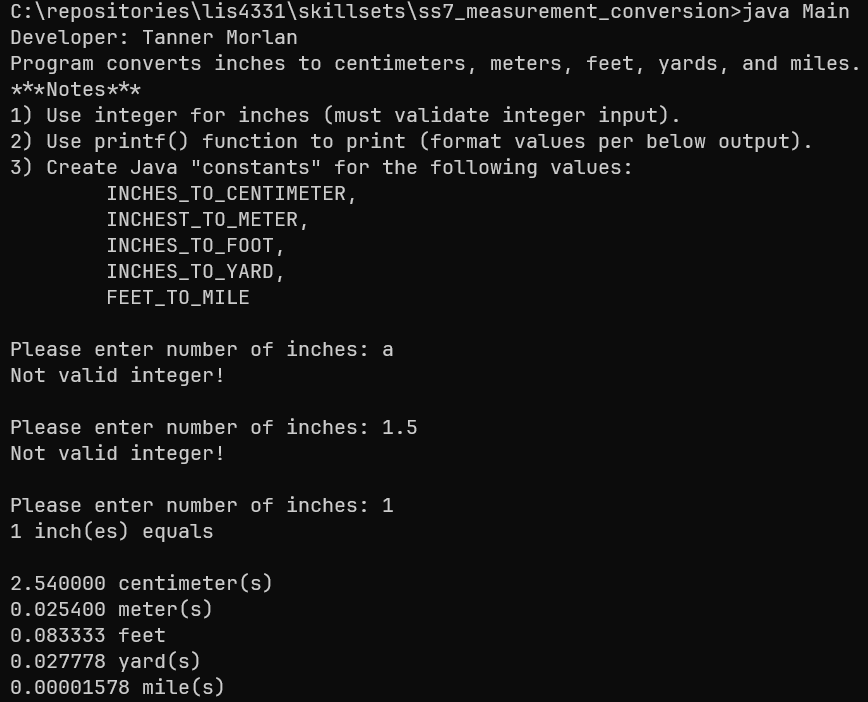
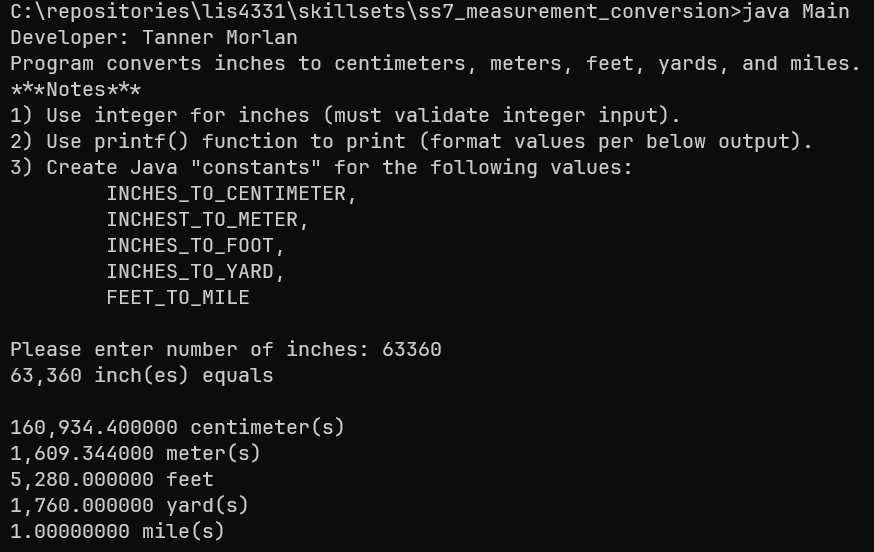
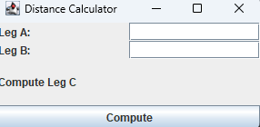
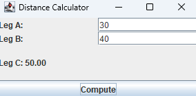
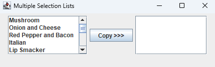
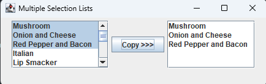
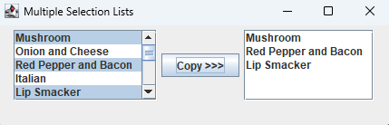

> **NOTE:** This README.md file should be placed at the **root of each of your repos directories.**
>
>Also, this file **must** use Markdown syntax, and provide project documentation as per below--otherwise, points **will** be deducted.
>

# LIS4331 - Advanced Mobile Applications Development

## Tanner Morlan

### **Project 1  Requirements:**

*Eight Parts*

1. Create App that plays music.
2. Include splash screen image, app title, intro text.
3. Include artists’ images and media.
4. Images and buttons must be vertically and horizontally aligned.
5. Must add background color(s) or theme
6. Create and display launcher icon image
7. App *must* be scrollable—*both* horizontally and vertically
8. Show play and pause screens.

**README.md file should include the following items:**

- Screenshot of running application’s splash screen
- Screenshot of running application’s follow-up screen (with images and buttons)
- Screenshots of running application’s play and pause user interfaces (with images and buttons)
- Screenshot of skill sets

> This is a blockquote.
> 
> This is the second paragraph in the blockquote.
>

#### **Assignment Screenshots:**

| *Screenshot of running application’s splash screen* | *Screenshot of running application’s follow-up screen (with images and buttons)* |
| ------------- | ------------- |
|  | ") |

| *Screenshots of running application’s play and pause user interfaces (with images and buttons) - 1* | *Screenshots of running application’s play and pause user interfaces (with images and buttons) - 2* | *Screenshots of running application’s play and pause user interfaces (with images and buttons) - 3* |
| ------------- | ------------- | ------------- |
|  - 1") |  - 2") |  - 3") |

#### **Skill Sets:**

| *Code for [Skill Set 7](../skillsets/ss7_measurement_conversion/Methods.java)* | *Cont.* |
| ------------- | ------------- |
|  |  |

| *Code for [Skill Set 8](../skillsets/ss8_distance_calculator/DistanceCalculator.java)* | *Cont.* |
| ------------- | ------------- |
|  |  |

| *Code for [Skill Set 9](../skillsets/ss9_multiple_selection_lists/MultipleSelectionFrame.java)* | *Cont* | *Cont.* |
| ------------- | ------------- | ------------- |
|  |  |  |
